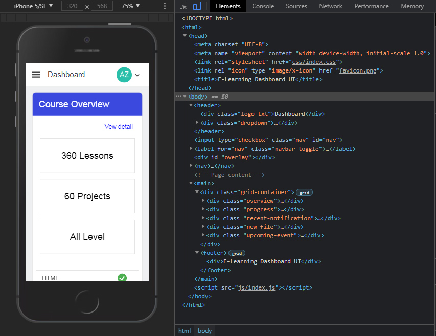

# E-Learning-Dashboard-UI
Responsive Dashboard UI in plain HTML, CSS, and JavaScript. No CSS Framework. I create it for learning front-end web development purpose.
Feel free to alternate and/or improve it. Free to use.
## Preview

